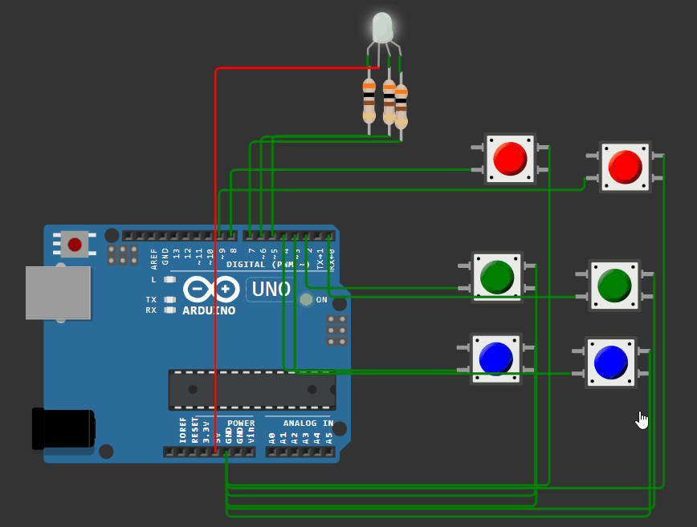

## Изменение цвета и яркости трёхцветного светодиода

 ```c++
const int button = 2;
int lastButton = LOW;
int curButton = LOW;
int LED = 0;
#define RED 5 
#define GREEN 6 
#define BLUE 7


int debounce (int last)
{
  int current = digitalRead(button);
  if (last !=current)
  {
    delay(5);
    current = digitalRead(button);
  }
  return current;
}

void setup()
{
pinMode(RED, OUTPUT);  
pinMode(GREEN, OUTPUT); 
pinMode(BLUE, OUTPUT);  

digitalWrite(RED, LOW);
digitalWrite(GREEN, LOW);
digitalWrite(BLUE, LOW);

pinMode(button, INPUT);
digitalWrite(button, HIGH);
}

void loop()
{
  curButton = debounce (lastButton);
  if (lastButton == HIGH && curButton==LOW)
  {
    switch(LED)
    {
    case 0:
    digitalWrite(RED, HIGH);
    digitalWrite(GREEN, LOW);
    digitalWrite(BLUE, LOW);
    LED++;
    break;

  case 1:
    digitalWrite(RED, LOW);
    digitalWrite(GREEN, HIGH);
    digitalWrite(BLUE, LOW);
    LED++;
    break;

  case 2:
    digitalWrite(RED, LOW);
    digitalWrite(GREEN, LOW);
    digitalWrite(BLUE, HIGH);
    LED++;
    break;

  case 3:
    digitalWrite(RED, HIGH);
    digitalWrite(GREEN, HIGH);
    digitalWrite(BLUE, HIGH);
    LED++;
    break;

  case 4:
    digitalWrite(RED, LOW);
    digitalWrite(GREEN, LOW);
    digitalWrite(BLUE, LOW);
    LED=0;
    break;
}
  }
  lastButton = curButton;
}
```

