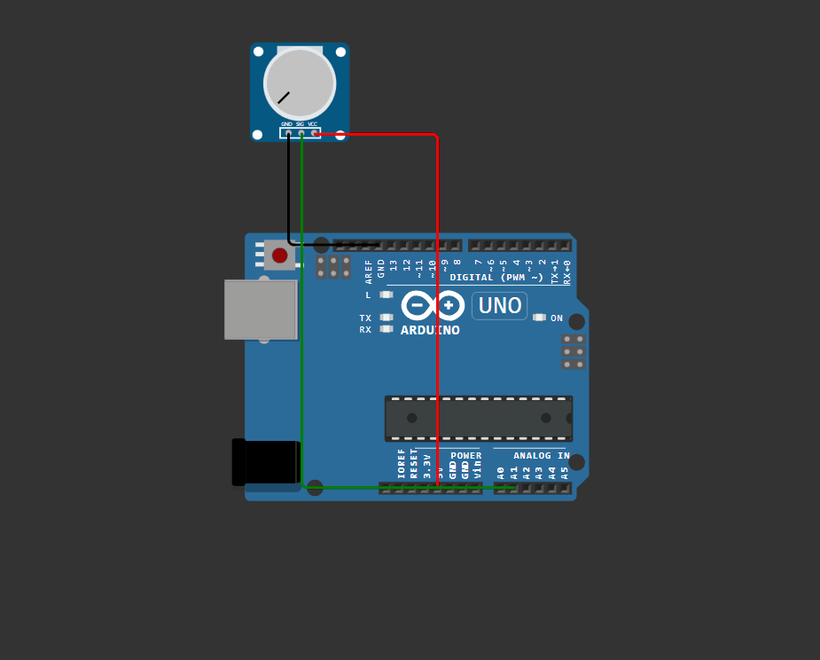

## 

 ```c++

#define joyX A0
#define joyY A1


const int ledCount = 6;
int position = 3;
int brightness = 100;
int ledPins[] = { 3, 5, 6, 9, 10, 11};


void setup() 
{
  Serial.begin(9600);

  for (int thisLed = 0; thisLed < ledCount; thisLed++) 
  {
    pinMode(ledPins[thisLed], OUTPUT);
    analogWrite(ledPins[thisLed], false);
  }
}

void loop() 
{
Serial.print("---");
Serial.print("Диод в позиции: ");
Serial.print(position);
Serial.print(" ,Яркость диода: ");
Serial.print(brightness);
Serial.println("---");
analogWrite(ledPins[position], true);
analogWrite(ledPins[position], brightness);

delay(500);

int xValue = analogRead(joyX);
int yValue = analogRead(joyY);

if (yValue==0 && xValue==512)
{
  if(position == 0) 
  {
  position = 6;
  analogWrite(ledPins[0], false);
  analogWrite(ledPins[6], true);
  analogWrite(ledPins[6], brightness);
  }
  else
  {
  position--;
  Serial.println(position);
  analogWrite(ledPins[position+1], false);
  analogWrite(ledPins[position], true);
  analogWrite(ledPins[position], brightness); 
  }
}

if (yValue==512 && xValue==0)
{
  if(brightness == 0) 
  {
    brightness == 0;
  }
  else
  {
  brightness = brightness - 10;
  }
}

if (yValue==512 && xValue==1023)
{
if(brightness == 250) 
  {
    return 1;
  }
  else
  {
  brightness = brightness + 10;
  }
}

if (yValue==1023 && xValue==512 )
{
  if(position == 6) 
  {
  position = 0;
  analogWrite(ledPins[6], false);
  analogWrite(ledPins[0], true);
  analogWrite(ledPins[0], brightness);
  }
  else
  {
  position++;
  Serial.println(position);
  analogWrite(ledPins[position-1], false);
  analogWrite(ledPins[position], true);
  analogWrite(ledPins[position], brightness);
  }
}
}


```

