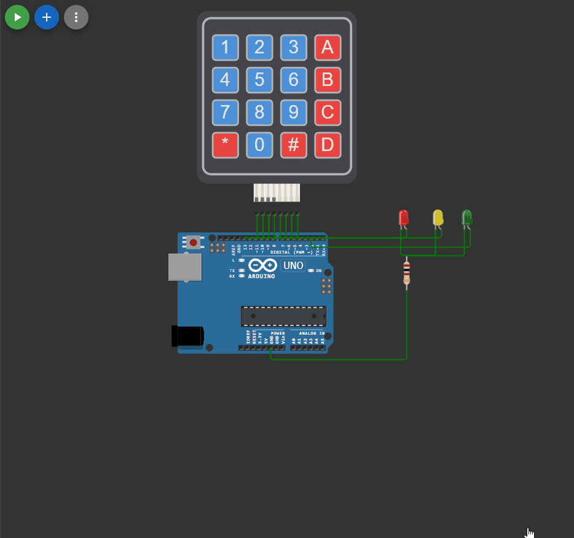

## 

 ```c++
#include "Keypad.h"
const byte Rows= 4; // количество строк на клавиатуре
const byte Cols= 4; // количество столбцов на клавиатуре

const int ledCount = 3;
int ledPins[] = {2,12,13};

bool ledPins_on[] = {false,false,false};
int time = 0;

// определяем массив символов соответствующий распределению кнопок на клавиатуре:
char keymap[Rows][Cols]=
{
{'1', '2', '3', 'A'},
{'4', '5', '6', 'B'},
{'7', '8', '9', 'C'},
{'*', '0', '#','D'}
};
// соединения клавиатуры с выводами Arduino:
byte rPins[Rows]= {11,10,9,8};
byte cPins[Cols]= {7,6,5,4};
// создаем объект класса Keypad
Keypad kpd= Keypad(makeKeymap(keymap), rPins, cPins, Rows, Cols);

void setup()
{
  for (int thisLed = 0; thisLed < ledCount; thisLed++) {
    digitalWrite(ledPins[thisLed], OUTPUT);
    digitalWrite(ledPins[thisLed], HIGH);
  }
Serial.begin(9600); 
}

void blink (int time)
{
  if (time == 0)
  {
    for (int thisLed = 3; thisLed >= 0; thisLed--) 
    {
      digitalWrite(ledPins[thisLed], ledPins_on[thisLed]);
    }
  }
  else
  {
    for (int thisLed = 3; thisLed >= 0; thisLed--) 
    {
      if (ledPins_on[thisLed] == true)
      {
        digitalWrite(ledPins[thisLed], LOW);
        delay(time);
        digitalWrite(ledPins[thisLed], HIGH);
      } 
    }
  }
}

void loop()
{
blink(time);
char keypressed = kpd.getKey();
if (keypressed != NO_KEY)
{
  switch(keypressed)
    {
        case '0':
            digitalWrite(ledPins[0], false);
            digitalWrite(ledPins[1], false);
            digitalWrite(ledPins[2], false);
            ledPins_on[0] = false;
            ledPins_on[1] = false;
            ledPins_on[2] = false;
            break;
        case '1': 
            digitalWrite(ledPins[0], true);
            digitalWrite(ledPins[1], false);
            digitalWrite(ledPins[2], false);
            ledPins_on[0] = true;
            ledPins_on[1] = false;
            ledPins_on[2] = false;
            break;
        case '2': 
            digitalWrite(ledPins[0], false);
            digitalWrite(ledPins[1], true);
            digitalWrite(ledPins[2], false);
            ledPins_on[0] = false;
            ledPins_on[1] = true;
            ledPins_on[2] = false;
            break;
        case '3':
            digitalWrite(ledPins[0], false);
            digitalWrite(ledPins[1], false);
            digitalWrite(ledPins[2], true); 
            ledPins_on[0] = false;
            ledPins_on[1] = false;
            ledPins_on[2] = true;
            break;
        case '4': 
            digitalWrite(ledPins[0], true);
            digitalWrite(ledPins[1], true);
            digitalWrite(ledPins[2], false);
            ledPins_on[0] = true;
            ledPins_on[1] = true;
            ledPins_on[2] = false;
            break;
        case '5': 
            digitalWrite(ledPins[0], true);
            digitalWrite(ledPins[1], false);
            digitalWrite(ledPins[2], true);
            ledPins_on[0] = true;
            ledPins_on[1] = false;
            ledPins_on[2] = true;
            break;
        case '6': 
            digitalWrite(ledPins[0], false);
            digitalWrite(ledPins[1], true);
            digitalWrite(ledPins[2], true);
            ledPins_on[0] = false;
            ledPins_on[1] = true;
            ledPins_on[2] = true;
            break;
        case '7': 
            digitalWrite(ledPins[0], true);
            digitalWrite(ledPins[1], true);
            digitalWrite(ledPins[2], true);
            ledPins_on[0] = true;
            ledPins_on[1] = true;
            ledPins_on[2] = true;
            break;
        case 'A': 
            time = 100;
            break;
        case 'B': 
            time = 50;
            break;
        case 'C': 
            time = 25;
            break;
        case 'D': 
            time = 0;
            break;
        default: 
            Serial.print("Такой кнопки нет ");
            Serial.println(keypressed);
            break;
    }
  }
}
```


