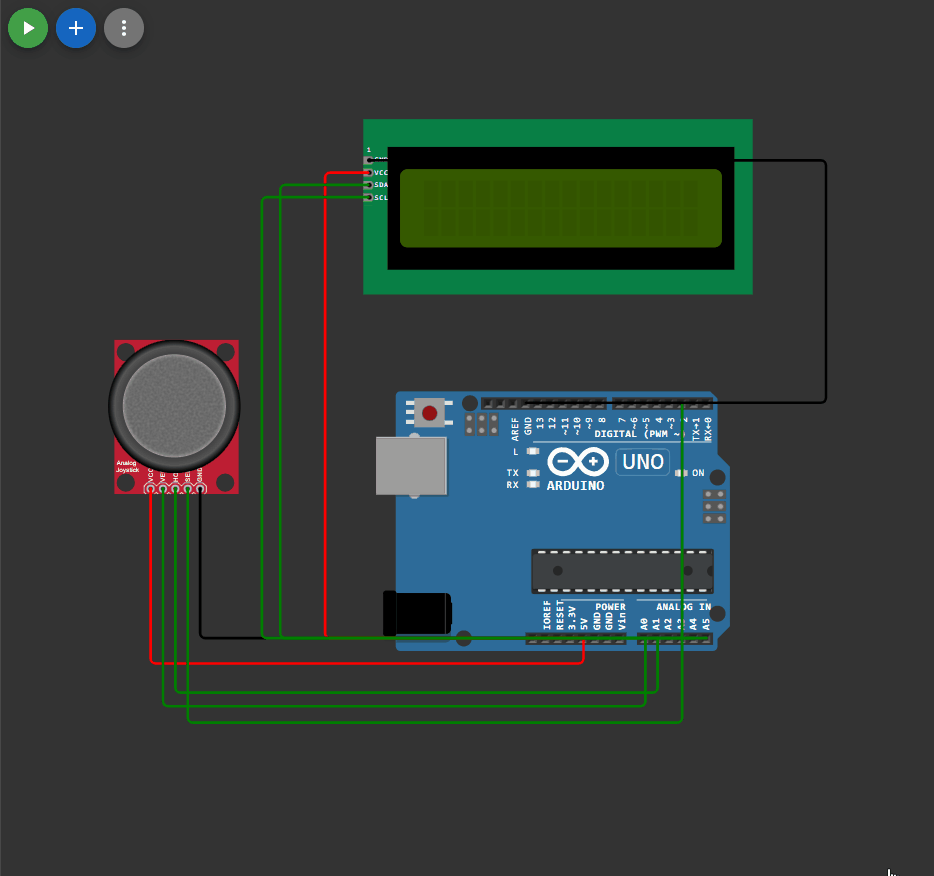

## 

 ```c++

#include <EncButton.h>
#include <LiquidCrystal_I2C_Hangul.h>
LiquidCrystal_I2C_Hangul lcd(0x27, 16, 2);


#define joyX A0
#define joyY A1
int x=1, y=1, i=0;
Button btn(2);

char s[] ="ABCDEFGHIJKLMNOPQRSTUVWXYZ";

void setup() 
{
  lcd.init();           // инициализация
  lcd.backlight();      // включить подсветку  
  // строки для вывода
  char s1[] = "Hello, world!";
  char s2[] = "H4 Z3";
  lcd.setCursor(1, 0);
  for (int i = 0; i < strlen(s1); i++) 
  {
    lcd.print(s1[i]);
    delay(100);
  }
  lcd.setCursor(4, 1);
  for (int i = 0; i < strlen(s2); i++) 
  {
    lcd.print(s2[i]);
    delay(100);
  }

  lcd.clear();
  lcd.cursor(); 
  Serial.begin(9600); 
}

void loop()
{
delay(100);
lcd.setCursor(x, y);

btn.tick();
if (btn.click())
{
  if (y == 0 )
  {
    y=1;
  }
  else 
  {
    y=0;
  }
}

int xValue = analogRead(joyX);
int yValue = analogRead(joyY);


if (yValue==0 && xValue==512)
{
  if (x <= 14 )
  {
    i=0;
    x++;
  }
}

if (yValue==512 && xValue==0)
{
  if (i==0)
  { 
    lcd.print(s[i]); 
    i=25; 
  }
  else
  {
    lcd.print(s[i]);
    i--;
  }
}

if (yValue==512 && xValue==1023)
{
  if (i==25)
  {
    lcd.print(s[i]);
    i=0; 
  }
  else
  {
    lcd.print(s[i]); 
    i++;
  }
}

if (yValue==1023 && xValue==512 )
{
  if (x > 0 )
  {
    i=0;
    x--;
  }
}
}


```

