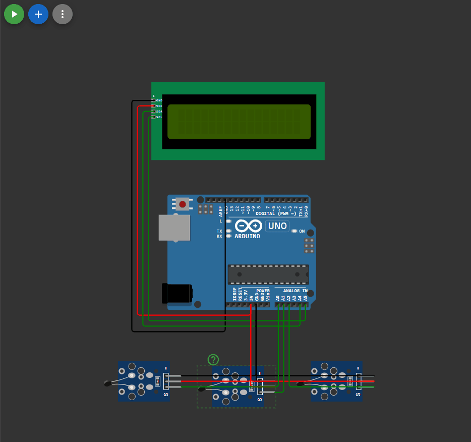

## 

 ```c++

#include <LiquidCrystal_I2C_Hangul.h>
#include <math.h>

LiquidCrystal_I2C_Hangul lcd(0x27, 16, 2);

char min_t_c[] = "MIN=";
char max_t_c[] = "MAX=";
char arg_t_c[] = "ARG=";

float min_t = 100;
float max_t = -100;
float arg_t =0;


float Getterm(int RawADC)
{
  float celsius = 1 / (log(1 / (1023. / RawADC - 1)) / 3950 + 1.0 / 298.15) - 273.15;
  return celsius;
}

float midArifm(int analog_sig) 
{
  float sum = 0;                      // локальная переменная sum
  for (int i = 0; i < 10; i++)  // согласно количеству усреднений
    sum += analog_sig;                  // суммируем значения с любого датчика в переменную sum
  return (sum / 10);
}

void setup() 
{
  lcd.init();
  lcd.backlight();
  char s1[] = "Hello, world!";
  char s2[] = "H5 Z2";
  lcd.setCursor(1, 0);

  for (int i = 0; i < strlen(s1); i++) 
  {
    lcd.print(s1[i]);
    delay(100);
  }

  lcd.setCursor(4, 1);
  for (int i = 0; i < strlen(s2); i++) 
  {
    lcd.print(s2[i]);
    delay(100);
  }

  lcd.clear();
  lcd.cursor(); 
  Serial.begin(9600); 
}

void loop() 
{
delay(100);
float temp_1 = Getterm(midArifm(analogRead(A0)));
float temp_2 = Getterm(midArifm(analogRead(A1)));
float temp_3 = Getterm(midArifm(analogRead(A2)));

max_t = max(temp_1, max(temp_2, temp_3));
min_t = min(temp_1, min(temp_2, temp_3));

arg_t = (arg_t  + ((temp_1 + temp_2 + temp_3)/3))/2;
//if (((temp_1 + temp_2 + temp_3)/3) > max_t)
//{
//  max_t = ((temp_1 + temp_2 + temp_3)/3);
//}

//if (((temp_1 + temp_2 + temp_3)/3) < min_t)
//{
//  min_t = ((temp_1 + temp_2 + temp_3)/3);
//}

lcd.clear(); 
lcd.setCursor(0, 0); 
lcd.print (min_t_c);
lcd.print (min_t);
lcd.setCursor(8, 0); 
lcd.print (max_t_c);
lcd.print (max_t);
lcd.setCursor(4, 1); 
lcd.print (arg_t_c);
lcd.print (arg_t);
}


```

