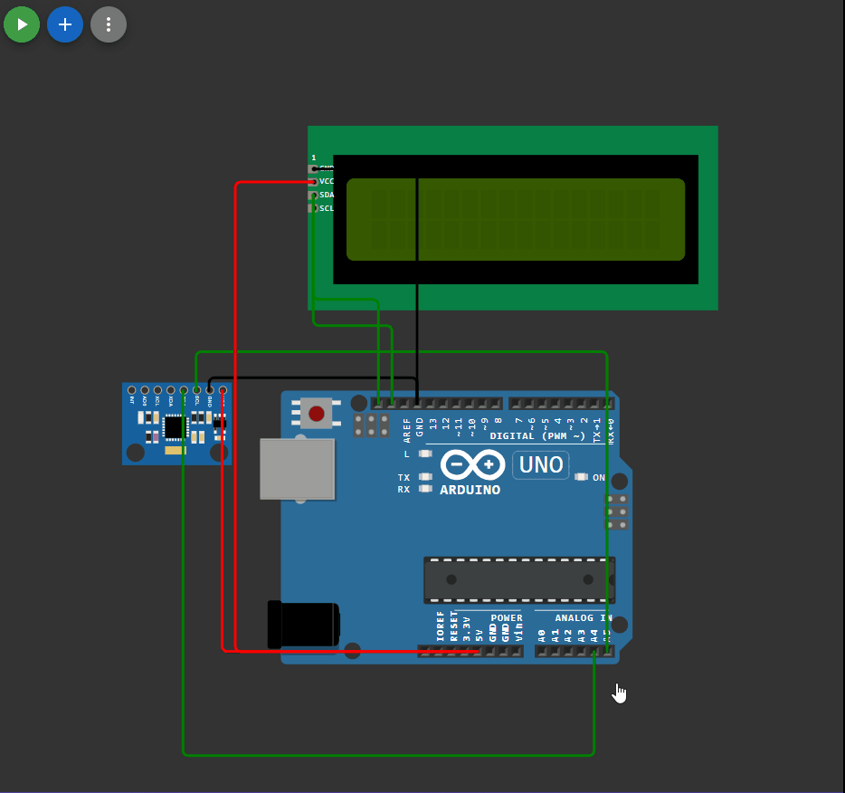

## 

 ```c++

#include <LiquidCrystal_I2C_Hangul.h>
#include "MPU6050.h"
MPU6050 mpu;
LiquidCrystal_I2C_Hangul lcd(0x27, 16, 2);

void setup() 
{
  Wire.begin();
  Serial.begin(9600);
  mpu.initialize();     // запускаем датчик

  lcd.init();
  lcd.backlight();
  char s1[] = "Hello, world!";
  char s2[] = "H6 Z1";
  lcd.setCursor(1, 0);

  for (int i = 0; i < strlen(s1); i++) 
  {
    lcd.print(s1[i]);
    delay(100);
  }

  lcd.setCursor(4, 1);
  for (int i = 0; i < strlen(s2); i++) 
  {
    lcd.print(s2[i]);
    delay(100);
  }

  lcd.clear();
  lcd.cursor(); 
 
}

void loop() 
{
  int16_t ax = mpu.getAccelerationX();  // ускорение по оси Х
  // стандартный диапазон: +-2g
  ax = constrain(ax, -16384, 16384);    // ограничиваем +-1g
  float angle_x = ax / 16384.0;           // переводим в +-1.0
  // и в угол через арксинус
  if (angle_x < 0) angle_x = 90 - degrees(acos(angle_x));
  else angle_x = degrees(acos(-angle_x)) - 90;

  int16_t ay = mpu.getAccelerationY();  // ускорение по оси Х
  // стандартный диапазон: +-2g
  ay = constrain(ay, -16384, 16384);    // ограничиваем +-1g
  float angle_y = ay / 16384.0;           // переводим в +-1.0
  // и в угол через арксинус
  if (angle_y < 0) angle_y = 90 - degrees(acos(angle_y));
  else angle_y = degrees(acos(-angle_y)) - 90;

  int16_t az = mpu.getAccelerationZ();  // ускорение по оси Х
  // стандартный диапазон: +-2g
  az = constrain(az, -16384, 16384);    // ограничиваем +-1g
  float angle_z = az / 16384.0;           // переводим в +-1.0
  // и в угол через арксинус
  if (angle_z < 0) angle_z = 90 - degrees(acos(angle_z));
  else angle_z = degrees(acos(-angle_z)) - 90;

  lcd.clear(); 
  lcd.setCursor(0, 0); 
  lcd.print ("X=");
  lcd.print (angle_x);

  lcd.setCursor(0, 1); 
  lcd.print ("Y=");
  lcd.print (angle_y);

  lcd.setCursor(7, 0); 
  lcd.print ("Z=");
  lcd.print (angle_z);

  delay(100);
}

```


