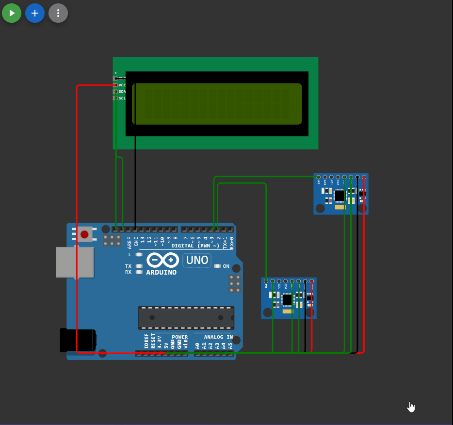

## 

 ```c++

#include <LiquidCrystal_I2C_Hangul.h>
#include "Wire.h"
#include "I2Cdev.h"
#include "MPU6050_6Axis_MotionApps20.h"

LiquidCrystal_I2C_Hangul lcd(0x27, 16, 2);
MPU6050 mpu_1(0x68); 
MPU6050 mpu_2(0x69); 

#define OUTPUT_READABLE_QUATERNION


bool dmpReady = false;  

uint8_t mpuIntStatus_1; 
uint8_t devStatus_1;    
uint16_t packetSize_1;   
uint16_t fifoCount_1;     
uint8_t fifoBuffer_1[256]; 

uint8_t mpuIntStatus_2; 
uint8_t devStatus_2;   
uint16_t packetSize_2;   
uint16_t fifoCount_2;    
uint8_t fifoBuffer_2[256]; 

Quaternion q1;           // [w, x, y, z]      
Quaternion q2;           // [w, x, y, z]   

uint8_t testigo = 1;

boolean mpu1_listo;
boolean mpu2_listo;

volatile bool mpuInterrupt_1 = false;
volatile bool mpuInterrupt_2 = false;

void dmp_1_DataReady() {
    mpuInterrupt_1 = true;
}

void dmp_2_DataReady() {
    mpuInterrupt_2 = true;
}

void setup() 
{

  Wire.begin();
  Serial.begin(115200);

  lcd.init();
  lcd.backlight();
  char s1[] = "Hello, world!";
  char s2[] = "H6 Z2";
  lcd.setCursor(1, 0);

  for (int i = 0; i < strlen(s1); i++) 
  {
    lcd.print(s1[i]);
    delay(100);
  }

  lcd.setCursor(4, 1);
  for (int i = 0; i < strlen(s2); i++) 
  {
    lcd.print(s2[i]);
    delay(100);
  }

  lcd.clear();
  lcd.cursor(); 

  while (!Serial); 

  lcd.setCursor(1, 0);
  lcd.print (F("Initializing I2C devices..."));
  Serial.println(F("Initializing I2C devices..."));
  mpu_1.initialize();
  mpu_2.initialize();

  lcd.setCursor(0, 1);

  lcd.print(F("Testing device connections..."));
  Serial.println(F("Testing device connections..."));
  delay(3000);

  lcd.clear();
  lcd.setCursor(0, 0);
  lcd.print (mpu_1.testConnection() ? F("MPU6050_1 connection successful") : F("MPU6050_1 connection failed"));
  lcd.setCursor(0, 1);
  lcd.print (mpu_2.testConnection() ? F("MPU6050_2 connection successful") : F("MPU6050_2 connection failed"));
  Serial.println(mpu_1.testConnection() ? F("MPU6050_1 connection successful") : F("MPU6050_1 connection failed"));
  Serial.println(mpu_2.testConnection() ? F("MPU6050_2 connection successful") : F("MPU6050_2 connection failed"));
  delay(3000);
  lcd.clear();

  lcd.setCursor(0, 0);
  lcd.print (F("\nSend any character to begin DMP programming and demo: "));

  Serial.println(F("\nSend any character to begin DMP programming and demo: "));
  while (Serial.available() && Serial.read()); // empty buffer
  while (!Serial.available());                 // wait for data
  while (Serial.available() && Serial.read()); // empty buffer again
  
  lcd.setCursor(0, 1);
  lcd.print (F("Initializing DMP..."));
  Serial.println(F("Initializing DMP..."));
  devStatus_1 = mpu_1.dmpInitialize();
  devStatus_2 = mpu_2.dmpInitialize();    

  if (devStatus_1 == 0) 
  {
    Serial.println(F("Enabling DMP..."));
    mpu_1.setDMPEnabled(true);

    attachInterrupt(0, dmp_1_DataReady, RISING); 
    mpuIntStatus_1 = mpu_1.getIntStatus();

    Serial.println(F("DMP ready! Waiting for first interrupt..."));
    dmpReady = true;

    packetSize_1 = mpu_1.dmpGetFIFOPacketSize();
  }
  else 
  {

    Serial.print(F("DMP 1 Initialization failed (code "));
    Serial.print(devStatus_1);
    Serial.println(F(")"));
  }
    
  if (devStatus_2 == 0) 
  {
    Serial.println(F("Enabling DMP..."));
    mpu_2.setDMPEnabled(true);
    Serial.println(F("Enabling interrupt detection (Arduino external interrupt 0)..."));
    attachInterrupt(1, dmp_2_DataReady, RISING); 
    mpuIntStatus_2 = mpu_2.getIntStatus();

    Serial.println(F("DMP ready! Waiting for first interrupt..."));
    dmpReady = true;
    packetSize_2 = mpu_2.dmpGetFIFOPacketSize();
    }
    else 
    {
      Serial.print(F("DMP 2 Initialization failed (code "));
      Serial.print(devStatus_2);
      Serial.println(F(")"));
    }

}


void loop() {

    if (!dmpReady) return;

    while ( (!mpuInterrupt_1 && fifoCount_1 < packetSize_1) ||(!mpuInterrupt_2 && fifoCount_2 < packetSize_2) ){

    }
 mpu1_listo=(!(!mpuInterrupt_1 && fifoCount_1 < packetSize_1) );
 mpu2_listo=(!(!mpuInterrupt_2 && fifoCount_2 < packetSize_2) );
 
 if (mpu1_listo)
 { 
  if ((!mpu2_listo)||(testigo == 1))
   {

    mpuInterrupt_1 = false;
    mpuIntStatus_1 = mpu_1.getIntStatus();


    fifoCount_1 = mpu_1.getFIFOCount();


    if ((mpuIntStatus_1 & 0x10) || fifoCount_1 == 1024) {

        mpu_1.resetFIFO();
        Serial.println(F("FIFO 1 overflow!"));


    } else if (mpuIntStatus_1 & 0x02) {

        while (fifoCount_1 < packetSize_1) fifoCount_1 = mpu_1.getFIFOCount();


        if (packetSize_1 >= 64) Serial.println("mierda");
        mpu_1.getFIFOBytes(fifoBuffer_1, packetSize_1);

        fifoCount_1 -= packetSize_1;

        #ifdef OUTPUT_READABLE_QUATERNION

            mpu_1.dmpGetQuaternion(&q1, fifoBuffer_1);
            Serial.print("0\t");
            Serial.print(q1.w);
            Serial.print("\t");
            Serial.print(q1.x);
            Serial.print("\t");
            Serial.print(q1.y);
            Serial.print("\t");
            Serial.println(q1.z);
        #endif
    }
    }
}

if (mpu2_listo)
{ 
    if ((!mpu1_listo)||(testigo == 2)){

    mpuInterrupt_2 = false;
    mpuIntStatus_2 = mpu_2.getIntStatus();


    fifoCount_2 = mpu_2.getFIFOCount();


    if ((mpuIntStatus_2 & 0x10) || fifoCount_2 == 1024) {

        mpu_2.resetFIFO();
        Serial.println(F("FIFO 2 overflow!"));


    } else if (mpuIntStatus_2 & 0x02) {

        while (fifoCount_2 < packetSize_2) fifoCount_2 = mpu_2.getFIFOCount();

        if (packetSize_2 >= 64) Serial.println("mierda");
        mpu_2.getFIFOBytes(fifoBuffer_2, packetSize_2);

        fifoCount_2 -= packetSize_2;

        #ifdef OUTPUT_READABLE_QUATERNION

            mpu_2.dmpGetQuaternion(&q2, fifoBuffer_2);
            Serial.print("1\t");
            Serial.print(q2.w);
            Serial.print("\t");
            Serial.print(q2.x);
            Serial.print("\t");
            Serial.print(q2.y);
            Serial.print("\t");
            Serial.println(q2.z);
        #endif
    }
    }
}

if (testigo==1) {
  testigo=2;  
  mpu_1.resetFIFO();
}
else {
  testigo = 1;
  mpu_2.resetFIFO();
}
}


```

