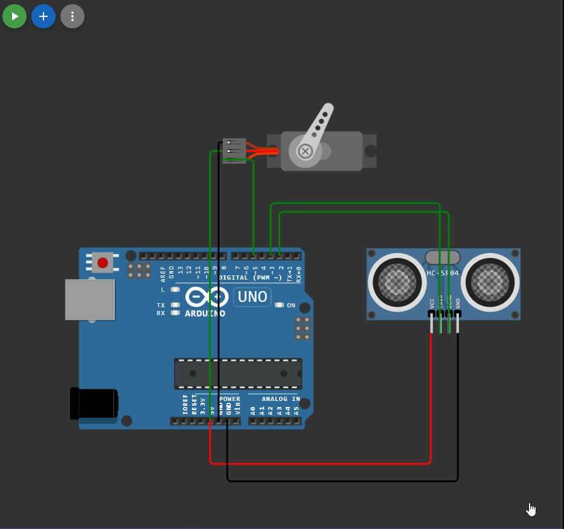

## 

 ```c++

#include <Servo.h>
#include <NewPing.h>
#define HC_TRIG 3
#define HC_ECHO 2

Servo myservo;
NewPing sonar(HC_TRIG, HC_ECHO, 400);

void setup() 
{
  myservo.attach(5);
  Serial.begin(9600);       // для связи
}

void loop() 
{
int val = map(sonar.ping_cm(), 0, 400, 0, 180);
myservo.write(val);
delay(10);
}


```

