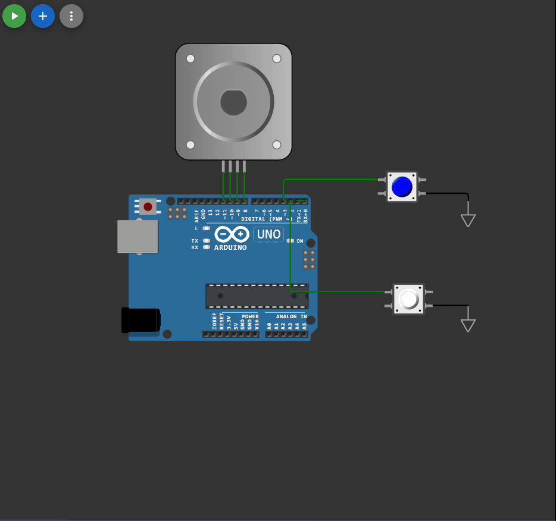

## 

 ```c++


#include <GyverStepper.h>
GStepper< STEPPER4WIRE> stepper(2038, 8, 9, 10, 11);

const int button_Start = 2; 
const int button_revers = 3;

bool revers = false;
bool start = false ; 

int lastButto_Start = LOW; //предыдущее состояние кнопки
int curButton_Start = LOW; //Текущее состояние кнопки
int lastButto_revers = LOW; //предыдущее состояние кнопки
int curButton_revers = LOW; //Текущее состояние кнопки


void setup() 
{
  Serial.begin(9600);
  pinMode(2, INPUT_PULLUP);
  attachInterrupt(0, F_start, FALLING);

  pinMode(3, INPUT_PULLUP);
  attachInterrupt(1, F_revers, FALLING);
  
  stepper.setRunMode(KEEP_SPEED); 
  stepper.stop();

}

int debounce(int last, int button )
{
  int current = digitalRead(button);
  if(last != current) //если состояние изменилось
  {
    delay(5);
    current = digitalRead(button);
  }
return current;
}


void F_revers() 
{
curButton_revers = debounce(lastButto_revers,  button_revers);
if(lastButto_revers == HIGH && curButton_revers == LOW)
{
  if (revers)
  {
    Serial.println("R");
    start = true ;
    revers = !revers;
  }
  else
  {
    Serial.println("L");
    start = true ;
    revers = !revers;
  }
}
lastButto_revers = curButton_revers;
}

void F_start() 
{
curButton_Start = debounce(lastButto_Start, button_Start );
if(lastButto_Start == HIGH && curButton_Start == LOW)
{
  if (start)
  {
    Serial.println("P");
    start = !start;
  }
  else
  {
    Serial.println("S");
    start = !start;
  }
}
lastButto_Start = curButton_Start;
}


void loop() 
{
  stepper.tick();
  if (Serial.available()) 
  {
    char ch = Serial.read();
    if (ch == 'P') stepper.brake();
    if (ch == 'S') stepper.setSpeedDeg(100);
    if (ch == 'L') {stepper.brake();stepper.setSpeedDeg(100);}
    if (ch == 'R') {stepper.brake();stepper.setSpeedDeg(-1*100);}
  }
}

```

