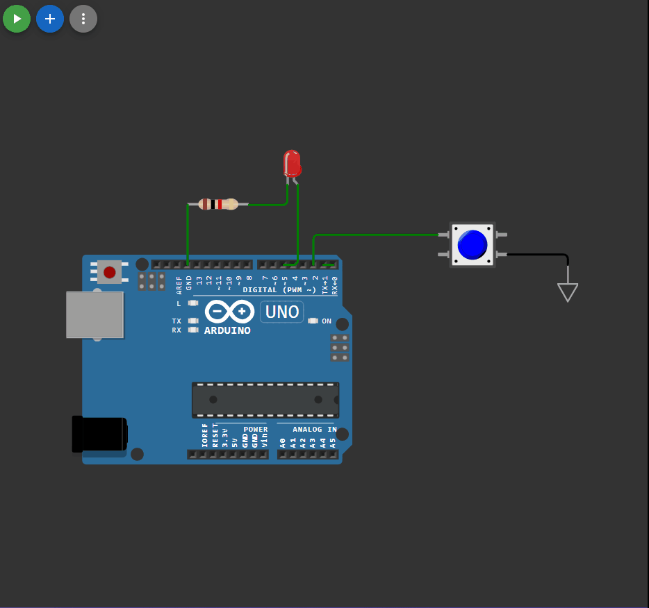

## 

 ```c++


const int pinLED = 5;
const int button = 2; 

int lastButton = LOW; //предыдущее состояние кнопки
int curButton = LOW; //Текущее состояние кнопки


void setup() 
{
  Serial.begin(9600);
  pinMode(pinLED, OUTPUT); // выход на светодиод
  pinMode(2, INPUT_PULLUP);
  attachInterrupt(0, Button_P, FALLING);
}

int debounce(int last, int button )
{
  int current = digitalRead(button);
  if(last != current) //если состояние изменилось
  {
    delay(5);
    current = digitalRead(button);
  }
return current;
}


void Button_P() 
{
curButton = debounce(lastButton,  button);
if(lastButton == HIGH && curButton == LOW)
{
  Serial.print("S");
}
lastButton = curButton;
}

void loop() 
{
  if (Serial.available()) 
  {
    char ch = Serial.read();
    if (ch == 'S')
    {
      digitalWrite(pinLED, HIGH);
      delay(400);
      digitalWrite(pinLED, LOW);
      delay(400);
      digitalWrite(pinLED, HIGH);
      delay(400);
      digitalWrite(pinLED, LOW);
      delay(400);
      digitalWrite(pinLED, HIGH);
      delay(400);
      digitalWrite(pinLED, LOW);
      delay(400);


      digitalWrite(pinLED, HIGH);
      delay(1000);
      digitalWrite(pinLED, LOW);
      delay(1000);
      digitalWrite(pinLED, HIGH);
      delay(1000);
      digitalWrite(pinLED, LOW);
      delay(1000);
      digitalWrite(pinLED, HIGH);
      delay(1000);
      digitalWrite(pinLED, LOW);
      delay(1000);

      digitalWrite(pinLED, HIGH);
      delay(400);
      digitalWrite(pinLED, LOW);
      delay(400);
      digitalWrite(pinLED, HIGH);
      delay(400);
      digitalWrite(pinLED, LOW);
      delay(400);
      digitalWrite(pinLED, HIGH);
      delay(400);
      digitalWrite(pinLED, LOW);
      delay(400);
    } 
  }
}

```

