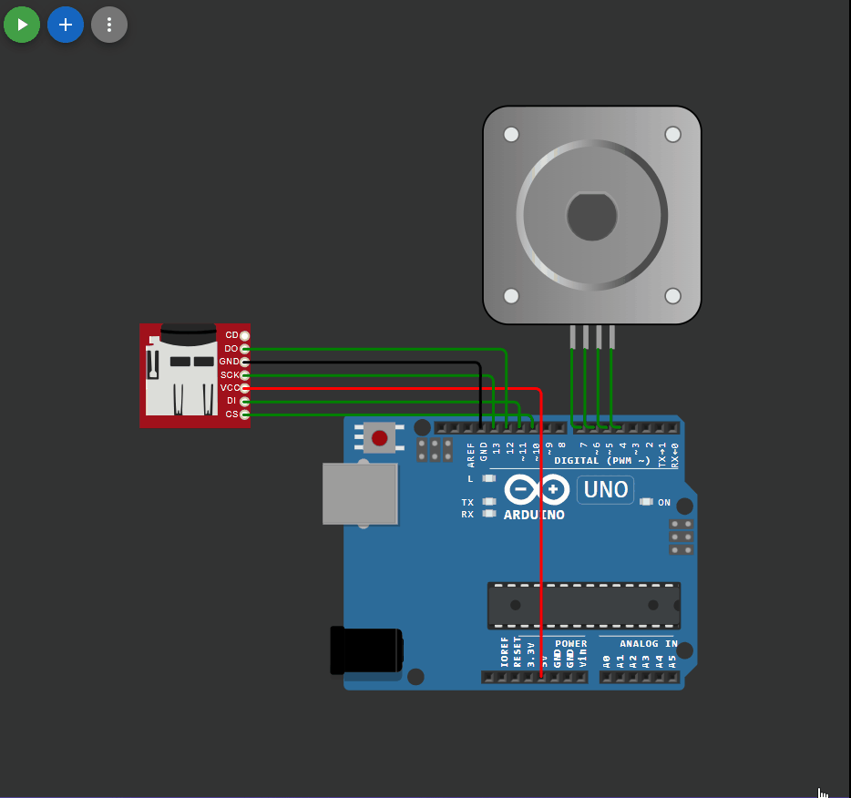

## 

 ```c++

#include <SD.h>
#include <Stepper.h>

const int CSPin = 10;

int stepsPerRevolution = 100; 
Stepper myStepper(stepsPerRevolution, 7, 6, 5, 4); 
int stepCount = 0; 
int rot = 1;

int arr[10][3];

int temp_int = 0;
int i = 0;
int j = 0;
int pause;

File root;

void setup()
{  
  Serial.begin(9600);
  Serial.print("Initializing SD card... ");
  if (!SD.begin(CSPin)) //Если ошибка инициализации, то блокирование работы
  {
    Serial.println("Card initialization failed!");
    while (1);
  }
  Serial.println("initialization done.");
  Serial.println("Files in the card:"); //считывание имен всех файлов на карте
  root = SD.open("/");
  Serial.println("");
  //Пример чтения из файла
  File textFile = SD.open("wokwi.txt");
  if (textFile)
  {
    Serial.println("Создали массив из файла wokwi.txt: ");

    while (textFile.available())
    {
      int temp = (int)textFile.read() - 48;

      if (temp != -38)
      {
        if (temp == -35)
          {    
            arr[i][j] = temp_int;
            Serial.print("arr[");Serial.print(i);Serial.print("][");Serial.print(j);Serial.print("] = ");Serial.print(arr[i][j] ); Serial.println(" "); 
            temp_int = 0;
            j=0;  
            i++;
          }
          else
          {  
            if (temp == -16 )
            {
              arr[i][j] = temp_int;
              Serial.print("arr[");Serial.print(i);Serial.print("][");Serial.print(j);Serial.print("] = ");Serial.print(arr[i][j] ); Serial.print(" ");          
              j++;
              temp_int = 0;
            }
            else 
            {
            temp_int = (temp_int*10)+temp;
            }
          }
        }
      }
    arr[9][2] = temp_int;
    Serial.print("arr[");Serial.print(9);Serial.print("][");Serial.print(2);Serial.print("] = ");Serial.print(arr[9][2] ); Serial.println(" "); 
       
    textFile.close();
  } 
  else 
  {
  Serial.println("error opening wokwi.txt!");
  }
}

void loop()
{
  int motorSpeed = map(1000, 0, 1023, 0, 100); // масштабирование этого значения
  for (int i=0; i<10; i++) 
  {
    Serial.print("Количество шагов = "); Serial.print(arr[i][0]); stepsPerRevolution = arr[i][0];
    Serial.print(", направление - ");
    if (arr[i][1] == 0)
    {
      Serial.print("по часовой стрелке");
      rot = 1;
    }
    else
    {
      Serial.print("против часовой стрелки");
      rot = -1;
    }
    Serial.print(", пауза в мс = ");
    Serial.println(arr[i][2]); pause=arr[i][2];

    myStepper.setSpeed(motorSpeed); //установка нового значения скорости
    myStepper.step(rot*(stepsPerRevolution / 100)); // сделать 1/100 полного оборота
    delay(pause);

  }
}


```

