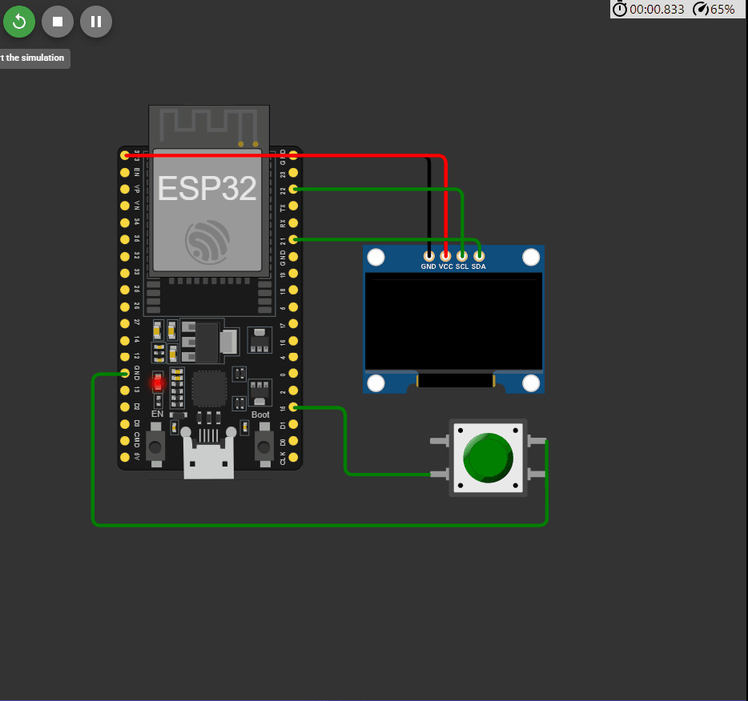

## 

 ```c++

#include <WiFi.h>
#include <HTTPClient.h>
#include <ArduinoJson.h>
#include <GyverOLED.h>
#include <EncButton.h>

GyverOLED<SSD1306_128x64, OLED_NO_BUFFER> oled;
Button btn(15);
bool btn1 = false;

// Вводим имя и пароль точки доступа
const String endpoint = "http://api.openweathermap.org/data/2.5/weather?q=Moscow,ru,pt&APPID=";
const String key = "cdecb72a7903eb3bb1964c39615f1764";

float humidity;
float feels_like;
float temp;
int timezone;
int dl = 3000000;
int i=0;

void handleReceivedMessage(String message)
{
  StaticJsonDocument<1500> doc;
  DeserializationError error = deserializeJson(doc, message);
  if (error)
  {
    oled.print(F("deserializeJson() failed: "));
    oled.println(error.c_str());
    return;
  }
  const char* name = doc["name"];
  timezone = doc["timezone"];
  humidity = doc["main"]["humidity"];
  feels_like = doc["main"]["feels_like"];
  temp = doc["main"]["temp"];
}

void setup()
{
  oled.init();        // инициализация
  oled.clear();       // очистка
  oled.setScale(1);   // масштаб текста (1..4)
  oled.home();        // курсор в 0,0


  WiFi.begin("Wokwi-GUEST", "", 6);
    while (WiFi.status() != WL_CONNECTED) 
  {
    delay(100);
    oled.print(".");
  }
  oled.println(" Connected!");
}

void loop()
{
if (dl == 3000000)
{
  HTTPClient http;
  http.begin(endpoint + key);
  int httpCode = http.GET(); 

  if (httpCode > 0)
    {
      String payload = http.getString();
      handleReceivedMessage(payload);
      oled.println(" ");
      oled.print("Ответ от сервера: "); oled.println(httpCode);
      oled.println("Данные обновленны");
      oled.println("Push Button");
    }
    else 
    {
      oled.println(" ");
      oled.print("Ответ от сервера: "); oled.println(httpCode);
      oled.println("Ошибка HTTP-запроса");
      oled.println("Push Button");
    }
  http.end();
  dl=0;
}
  btn.tick();
  if (btn.click()) 
  {
    oled.print(i);
    switch(i)
    {
      case 0:                  
          oled.clear();
          oled.home();
          oled.println("Температура: ");
          oled.print(temp - 273); oled.println(" C");
          i++;
        break;

      case 1:
          oled.clear();
          oled.home();
          oled.println("Влажность: ");
          oled.print(humidity); oled.println("%");
          i++;
        break;

      case 2:
        oled.clear();
        oled.home();
        oled.println("По ощущениям: ");
        oled.print(feels_like - 273); oled.println(" C");
        i=0;
        break;
    }
  }
dl++;
}


```

