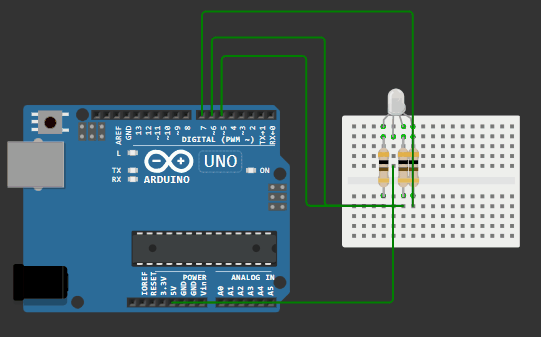

## Задача №1. Трёхцветный светодиод

 ```c++
#define RED 5 
#define GREEN 6 
#define BLUE 7

void setup()
{
pinMode(RED, OUTPUT);  
pinMode(GREEN, OUTPUT); 
pinMode(BLUE, OUTPUT);  
}

void loop()
{
   digitalWrite(RED, HIGH);
   digitalWrite(GREEN, HIGH);
   digitalWrite(BLUE, HIGH); // включаем синий свет

 for (int i = 0; i <= 255; i++) {
      analogWrite(RED, i);
      delay(2);
   }
   for (int i = 255; i >= 0; i--) {
      analogWrite(RED, i);
      delay(2);
   }

   // плавное включение/выключение зеленого цвета
   for (int i = 0; i <= 255; i++) {
      analogWrite(GREEN, i);
      delay(2);
   }
   for (int i = 255; i >= 0; i--) {
      analogWrite(GREEN, i);
      delay(2);
   }

   // плавное включение/выключение синего цвета
   for (int i = 0; i <= 255; i++) {
      analogWrite(BLUE, i);
      delay(2);
   }
   for (int i = 255; i >= 0; i--) {
      analogWrite(BLUE, i);
      delay(2);
   }
}
```

