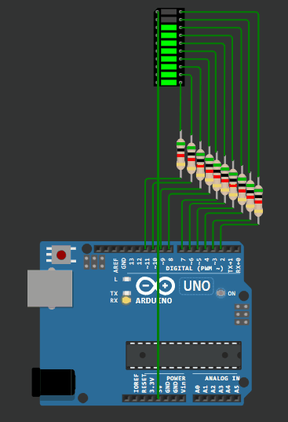

## Задача №2. Светодиодная линейка последовательное заполнение

 ```c++
const int ledCount = 10;
int ledPins[] = {
  2, 3, 4, 5, 6, 7, 8, 9, 10, 11
};

void setup()
{

for (int thisLed = 0; thisLed < ledCount; thisLed++) {
    pinMode(ledPins[thisLed], OUTPUT);
  }

}

void loop() 
{

for (int thisLed = 10; thisLed >= 0; thisLed--) 
{
  pinMode(ledPins[thisLed], HIGH);
  delay(50);
}
for (int thisLed = 0; thisLed < ledCount; thisLed++) 
{
  pinMode(ledPins[thisLed], LOW);
  delay(100);
}  
}
```

