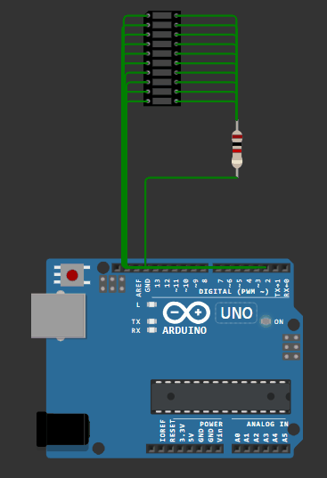

## Задача №3. Светодиодная линейка «бегающий огонёк»

 ```c++
const int ledCount = 10;
int ledPins[] = {
  2, 3, 4, 5, 6, 7, 8, 9, 10, 11
};


void setup()
{

for (int thisLed = 0; thisLed < ledCount; thisLed++) {
    digitalWrite(ledPins[thisLed], OUTPUT);
    digitalWrite(ledPins[thisLed], LOW);
  }

}

void loop() 
{

int time;
for (int x=0;x<4;x++)
{
switch(x)
{
  case 0:
    time = 100;
    break;
  case 1:
    time = 50;
    break;
  case 2:
    time = 25;
    break;
  case 3:
    time = 10;
    break;
}

for (int thisLed = 10; thisLed >= 0; thisLed--) 
{
  digitalWrite(ledPins[thisLed], HIGH);
  digitalWrite(ledPins[thisLed], LOW);
  delay(time);
}
   for (int thisLed = 0; thisLed < ledCount; thisLed++) 
   {
      digitalWrite(ledPins[thisLed], HIGH);
      digitalWrite(ledPins[thisLed], LOW);
      delay(time);
   }  
}
}

```

