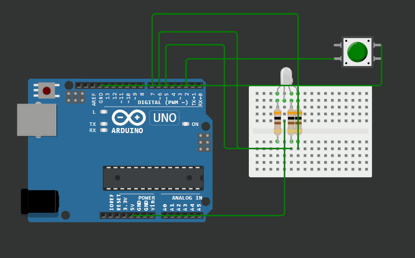

## Управление трёхцветным светодиодом

 ```c++
const int button_red_plus = 8;
const int button_red_minus = 9;
const int button_green_plus = 2 ;
const int button_green_minus = 0;
const int button_blue_plus = 4;
const int button_blue_minus = 3;

int brightness_red = 0;
int brightness_green = 0;
int brightness_blue = 0;


boolean plusUp_red = true;
boolean minusUp_red = true;
boolean plusUp_green = true;
boolean minusUp_green = true;
boolean plusUp_blue = true;
boolean minusUp_blue = true;

#define RED 5 
#define GREEN 6 
#define BLUE 7

boolean handleClick(int buttonPin, boolean wasUp)
{
   boolean isUp = digitalRead(buttonPin);
   if (wasUp && !isUp) 
   {
    delay(10);
    isUp = digitalRead(buttonPin);

    if (!isUp)
    {
    switch(buttonPin)
    {
    case 4:
    brightness_blue = constrain(brightness_blue - 50, 0, 250);
    break;
    

    case 3:
    brightness_blue = constrain(brightness_blue + 50, 0, 250);
    break;

    case 0:
    brightness_green = constrain(brightness_green + 50, 0, 250);
    break;

    case 2:
    brightness_green = constrain(brightness_green - 50, 0, 250);   
    break;

    case 8:
    brightness_red = constrain(brightness_red - 50, 0, 250); 
    break;

    case 9:
    brightness_red = constrain(brightness_red + 50, 0, 250);    
    break;

    }
   }
  }
  return isUp;
}

void setup()
{
pinMode(RED, OUTPUT);  
pinMode(GREEN, OUTPUT); 
pinMode(BLUE, OUTPUT);  

pinMode(button_red_plus, INPUT_PULLUP);
pinMode(button_red_minus, INPUT_PULLUP);
pinMode(button_green_plus, INPUT_PULLUP);
pinMode(button_green_minus, INPUT_PULLUP);
pinMode(button_blue_plus, INPUT_PULLUP);
pinMode(button_blue_minus, INPUT_PULLUP);
}

void loop()
{ 
  analogWrite(RED,brightness_red);
  analogWrite(GREEN,brightness_green);
  analogWrite(BLUE,brightness_blue);

  plusUp_red = handleClick(button_red_plus, plusUp_red);
  minusUp_red = handleClick(button_red_minus, minusUp_red);
  plusUp_green = handleClick(button_green_plus, plusUp_green);
  minusUp_green = handleClick(button_green_minus, minusUp_green);
  plusUp_blue = handleClick(button_blue_plus, plusUp_blue);
  minusUp_blue = handleClick(button_blue_minus, minusUp_blue);
}

```


