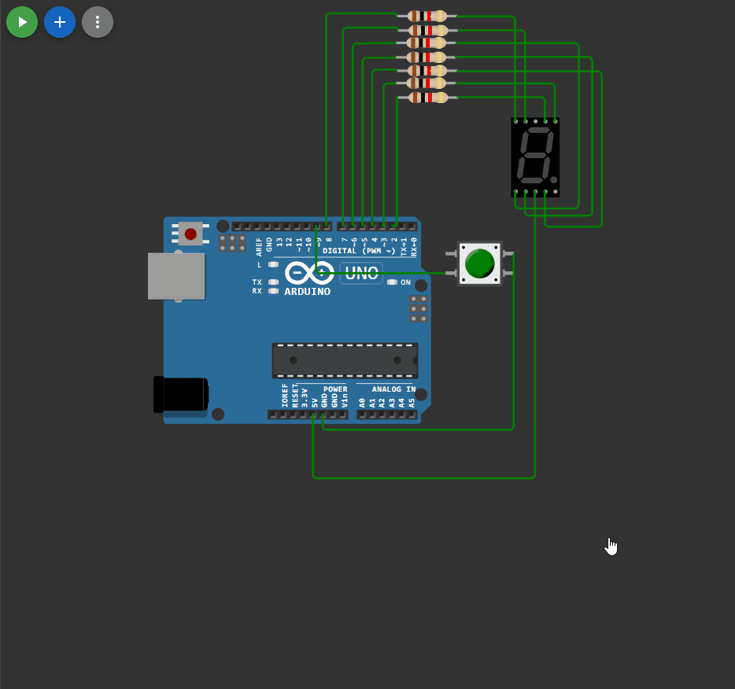

## 

 ```c++

#include <EncButton.h>

#define SEG_COUNT 7 //количество используемых сегментов
const int firstSeg = 2; //младший номер вывода для подключения индикатора

byte numberSegments[16] = 
{
0b11000000, //0
0b11111001, //1
0b10100100, //2
0b10110000, //3
0b10011001, //4
0b10010010, //5
0b10000010, //6
0b11111000, //7
0b10000000, //8
0b10010000, //9
0b10001000, //10
0b10000011, //11
0b11000110, //12
0b10100001, //13
0b10000110, //14
0b10001110, //15
};

// подключаем кнопку
Button btn(9);

// эту переменную будем менять
int value = 0;
int mask =0 ;
boolean enableSegment;

void setup() 
{
  for (int i = 0; i < SEG_COUNT; ++i)
  pinMode(i + firstSeg, OUTPUT);
  // открываем порт для связи
  Serial.begin(9600);

}

void loop() 
{
  // опрос кнопок происходит здесь
  btn.tick();

  // клик по кнопке - меняем значение и выводим в порт
  if (btn.click()) {
    if (value == 15)
    {
    value = 0;
    Serial.println(value);


    mask = numberSegments[value];
    // для каждого сегмента определяем: должен ли он быть включён.
    for (int i = 0; i < SEG_COUNT; i++)
    {
    enableSegment = bitRead(mask, i);
    digitalWrite(i + firstSeg, enableSegment);
    }


    }
    else
    {
    value += 1;
    Serial.println(value);
        mask = numberSegments[value];
    // для каждого сегмента определяем: должен ли он быть включён.
    for (int i = 0; i < SEG_COUNT; i++)
    {
    enableSegment = bitRead(mask, i);
    digitalWrite(i + firstSeg, enableSegment);
    }
    }
  }
}


```

