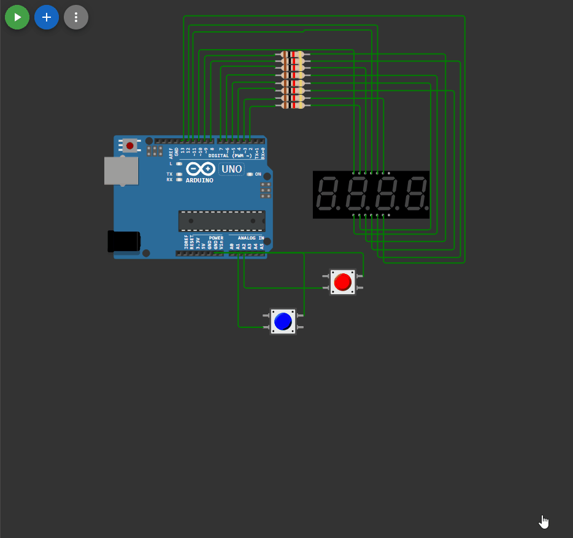

## 

 ```c++

#include <fDigitsSegtPin.h>
#include "button.h"


fDigitsSegtPin Display(6, 5, 9, 4, 8, 13, 3, 12, 11, 7, 2, 10);

button btn_reset(16);
button btn_start(15);

boolean mode = false;
void setup()
{
  Serial.begin(9600);
  Display.begin();
}

void loop()
{

  static unsigned long timer = millis(); //текущее время
  static float deciSeconds = 0; //время, отображаемое на индикаторе


  if (mode == true)
  {
    delay(10);
    timer += 10;
    deciSeconds += 0.01;
      if (deciSeconds >= 1000) // выход из диапазона
    {
      deciSeconds = 0;
    }
  }

  Display.print(deciSeconds); //периодический вызов функции в основном цикле

  if (btn_reset.click())
  {
    if (mode == false)
    {
      Serial.println("Обнулили таймер");
      deciSeconds = 0;
      Display.print(deciSeconds);
    }
    else
    {
      Serial.println("для начала остановите таймер");
    }
  }
  
  if (btn_start.click())
  {
    if (mode == false)
    { 
      mode = true;
      timer = deciSeconds;
    }
    else 
    {
      mode = false;
    }
  } 
}

```

