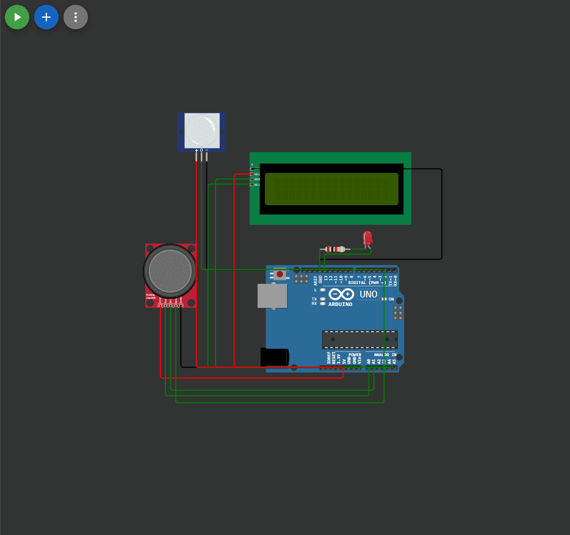

## 

 ```c++

#include <LiquidCrystal_I2C_Hangul.h>
LiquidCrystal_I2C_Hangul lcd(0x27, 16, 2);

const int ledPin = 13; // выход для светодиода
const int inputPin = 3; // вход от датчика
int pirState = LOW; // состояние датчика
int val = 0; // переменная для чтения состояния датчика


#define joyX A0
#define joyY A1
int i=0;

int s[9]{ 2, 3, 4, 5, 6, 7, 8, 9, 10 };

void setup() 
{
  pinMode(ledPin, OUTPUT); // выход для светодиода
  pinMode(inputPin, INPUT); // вход для датчика

  lcd.init();           // инициализация
  lcd.backlight();      // включить подсветку  
  // строки для вывода
  char s1[] = "Hello, world!";
  char s2[] = "H5 Z2";
  lcd.setCursor(1, 0);
  for (int i = 0; i < strlen(s1); i++) 
  {
    lcd.print(s1[i]);
    delay(100);
  }
  lcd.setCursor(4, 1);
  for (int i = 0; i < strlen(s2); i++) 
  {
    lcd.print(s2[i]);
    delay(100);
  }

  lcd.clear();
  lcd.cursor(); 

  lcd.setCursor(1, 0);
  lcd.print("SET TIME DIOD");
  lcd.setCursor(2, 1);
  lcd.print("default 2sec");
  
  Serial.begin(9600); 
}

void loop()
{
lcd.setCursor(2, 1);

int xValue = analogRead(joyX);
int yValue = analogRead(joyY);

if (yValue==512 && xValue==0)
{
  if (i==0)
  { 
    i=8;
    lcd.print("Time: ");
    lcd.print(s[i]);
    lcd.print(" Sec ");
     
  }
  else
  {
    i--;
    lcd.print("Time: ");
    lcd.print(s[i]);
    lcd.print(" Sec ");
    
  }
}
if (yValue==512 && xValue==1023)
{
  if (i==8)
  {
    i=0;
    lcd.print("Time: ");
    lcd.print(s[i]);
    lcd.print(" Sec ");
     
  }
  else
  {
    i++;
    lcd.print("Time: ");
    lcd.print(s[i]);
    lcd.print(" Sec ");
    
  }
}

val = digitalRead(inputPin);
if (val == HIGH) // есть сигнал от датчика
{
  
  digitalWrite(ledPin, HIGH); // включаем светодиод
  if (pirState == LOW)
  {
    pirState = HIGH;
    Serial.println("Motion detected!"); 
  }
}
else
{
  if (pirState == HIGH)
  {
    Serial.print("Выключаем через  ");
    Serial.print(s[i]);
    Serial.println(" секунд");
    delay(s[i]*1000);
    digitalWrite(ledPin, LOW); // выключаем светодиод  
    Serial.println("Motion ended!"); // отправляем сообщение только один раз
    pirState = LOW;
  }
}
}


```

