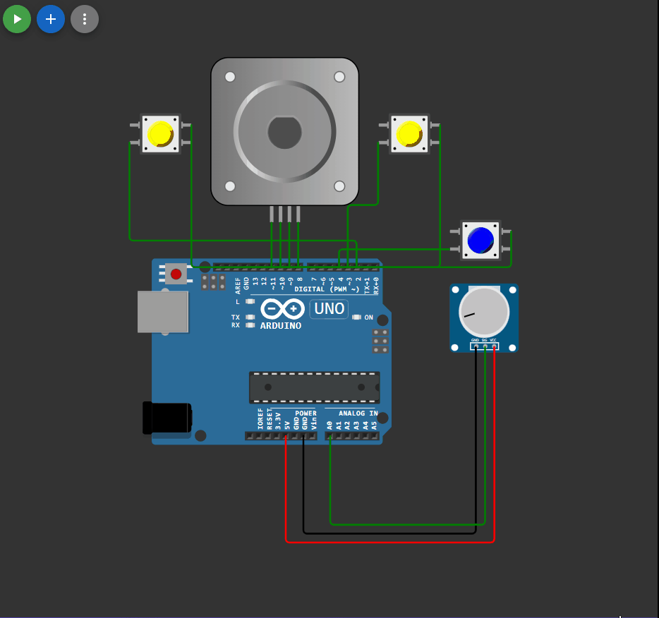

## 

 ```c++

#include <Stepper.h> 
#include <EncButton.h>

Button btn_left(2);
Button btn_start(4);
Button btn_right(3);

const int stepsPerRevolution = 200; 
Stepper myStepper(stepsPerRevolution, 8, 9, 10, 11); 
int stepCount = 0; 
int rot = 1;
bool start = false;


void setup() 
{

}
void loop()
{

  btn_left.tick();
  btn_start.tick();
  btn_right.tick();
  
  if (btn_left.click()) 
  {
    rot = -1;
  }

  if (btn_right.click()) 
  {
    rot = 1;
  }

  if (btn_start.click()) 
  {
    if (start) start=false;
    else start = true;
  }

  int sensor = analogRead(A0); // чтение значения потенциометра
  int motorSpeed = map(sensor, 0, 1023, 0, 100); // масштабирование этого значения
  if (motorSpeed > 0 && start == true)
  {
    myStepper.setSpeed(motorSpeed); //установка нового значения скорости
    myStepper.step(rot*(stepsPerRevolution / 100)); // сделать 1/100 полного оборота
  }


}

```

