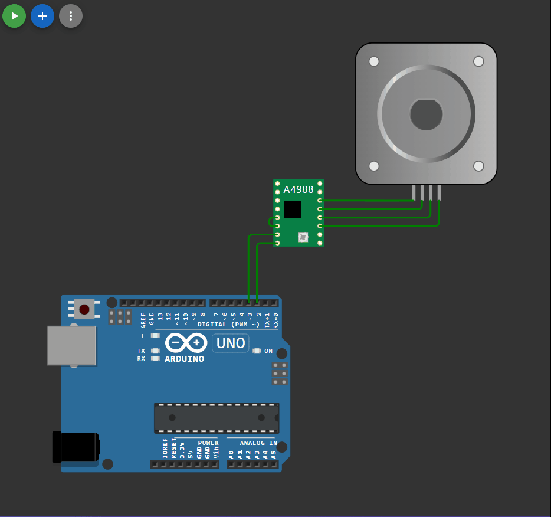

## 

 ```c++

#include <GyverStepper.h>
GStepper<STEPPER4WIRE> stepper(2048, 5, 3, 4, 2);

void setup() 
{
  stepper.setRunMode(FOLLOW_POS);
}

void loop() 
{
  if (!stepper.tick()) 
  {
    static bool dir;
    dir = !dir;

    if (dir == true)
    {
      stepper.setTarget (-800);
      stepper.setMaxSpeed(1000);
    }
    else 
    {
      stepper.setTarget (800);
      stepper.setMaxSpeed(80);
    }
  }
}


```

