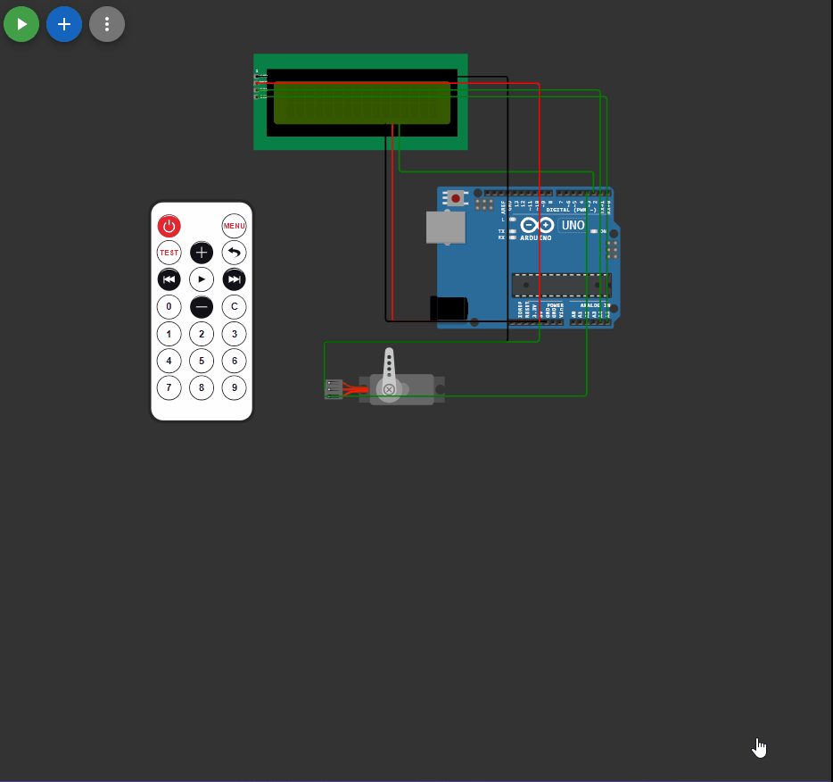

## 

 ```c++

#include <Servo.h>
#include <LiquidCrystal_I2C_Hangul.h>
#include <NecDecoder.h>
LiquidCrystal_I2C_Hangul lcd(0x27, 16, 2);

Servo myservo;
NecDecoder ir;

#define IR_1  12
#define IR_2  24
#define IR_3  94
#define IR_4  8
#define IR_5  28
#define IR_6  90
#define IR_7  66
#define IR_8  82
#define IR_9  74
#define IR_C  13
#define IR_0  22
#define IR_P  21

int angle = 0;
bool start = false;
int length_angle = -1;
int pos = 8;

void setup() 
{
  attachInterrupt(0, irIsr, FALLING);
  myservo.attach(3);

  lcd.init();           
  lcd.backlight();      
  // строки для вывода
  char s1[] = "Hello, world!";
  char s2[] = "H8 Z1";
  lcd.setCursor(1, 0);
  for (int i = 0; i < strlen(s1); i++) 
  {
    lcd.print(s1[i]);
    delay(100);
  }
  lcd.setCursor(4, 1);
  for (int i = 0; i < strlen(s2); i++) 
  {
    lcd.print(s2[i]);
    delay(100);
  }

  lcd.clear();
  lcd.cursor();

  Serial.begin(9600); 

  lcd.setCursor(1, 0);
  lcd.print("write angle ");
  lcd.setCursor(1, 1);
  lcd.print("angle = ");
}

void irIsr() 
{
  ir.tick();
}
void clear_display()
{
    lcd.clear();
    lcd.setCursor(1, 0);
    lcd.print("write angle ");
    lcd.setCursor(1, 1);
    lcd.print("angle = ");
}

void print_on_display(int selection, int length_angle, int pos)
{
  if (length_angle < 3)
  {
    lcd.setCursor(pos,1);
    lcd.print(selection);
  }
  return;
}

void loop() 
{

if (ir.available()) {
    switch (ir.readCommand()) 
    {
      case IR_1: 
        pos++;
        length_angle++;
        Serial.println("Pressed 1"); 
        print_on_display(1, length_angle, pos);
        angle = (angle*10)+1;
      break;

      case IR_2: 
        pos++;
        length_angle++;
        Serial.println("Pressed 2");
        print_on_display(2, length_angle, pos); 
        angle = (angle*10)+2;
      break;

      case IR_3: 
        pos++;
        length_angle++;
        Serial.println("Pressed 3"); 
        print_on_display(3, length_angle, pos); 
        angle = (angle*10)+3;
      break;

      case IR_4: 
        pos++;
        length_angle++;
        Serial.println("Pressed 4"); 
        print_on_display(4, length_angle, pos); 
        angle = (angle*10)+4;
      break;

      case IR_5: 
        pos++;
        length_angle++;
        Serial.println("Pressed 5"); 
        print_on_display(5, length_angle, pos); 
        angle = (angle*10)+5;
      break;
      case IR_6: 
        pos++;
        length_angle++;
        Serial.println("Pressed 6"); 
        print_on_display(6, length_angle, pos); 
        angle = (angle*10)+6;
      break;

      case IR_7: 
        pos++;
        length_angle++;
        Serial.println("Pressed 7"); 
        print_on_display(7, length_angle, pos); 
        angle = (angle*10)+7;
      break;

      case IR_8:
        pos++;
        length_angle++;
        Serial.println("Pressed 8"); 
        print_on_display(8, length_angle, pos); 
        angle = (angle*10)+8;
      break;

      case IR_9:
        pos++;
        length_angle++;
        Serial.println("Pressed 9"); 
        print_on_display(9, length_angle, pos); 
        angle = (angle*10)+9;
      break;

      case IR_C: 
        Serial.println("Pressed C"); 
        clear_display();
        length_angle = -1;
        angle = 0;
        pos = 8;
      break;

      case IR_0: 
        pos++;
        length_angle++;
        Serial.println("Pressed 0"); 
        print_on_display (0,length_angle, pos); 
        angle = (angle*10)+0;
      break;

      case IR_P: 
        Serial.print("Pressed PLAY , УГОЛ=");
        Serial.println(angle);
        if (angle >180)
        {
          Serial.println("УГОЛ долженбыть не больше 180 градусов ");
        }
        else
        {
          myservo.write(angle);
        }
        clear_display();
        length_angle = -1;
        angle = 0;
        pos = 8;
      break;
    }
  }
}

```

