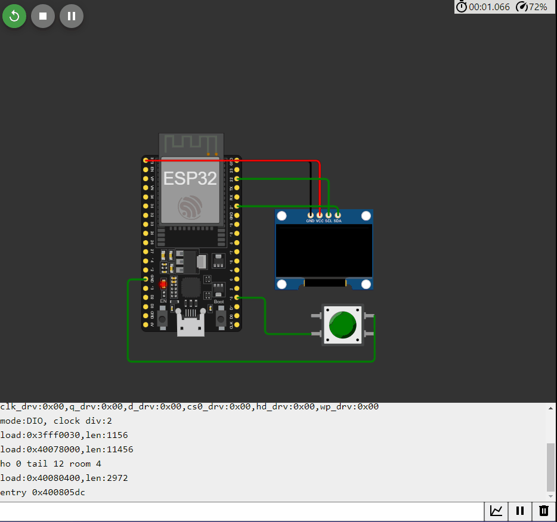

## 

 ```c++

#include "WiFi.h"
#include <GyverOLED.h>
#include <EncButton.h>

GyverOLED<SSD1306_128x64, OLED_NO_BUFFER> oled;
Button btn(15);
int i = -1;
int numberOfNetworks = 0;
uint32_t tmr;

void load()
{
  oled.clear();
  byte radius = 10;
  static int x = (128 / 2) * 10, y = (64 / 2) * 10;
  static int velX = 17, velY = 9;
  static bool fillFlag = 0;
  x += velX;
  y += velY;
  if (x >= (128 - radius) * 10 || x < radius * 10) {
    velX = -velX;
    fillFlag = !fillFlag;
  }
  if (y >= (64 - radius) * 10 || y < radius * 10) {
    velY = -velY;
    fillFlag = !fillFlag;
  }

  oled.circle(x / 10, y / 10, radius, fillFlag ? OLED_STROKE : OLED_FILL);
  oled.update();
}

void setup()
{
  oled.init();        // инициализация
  oled.clear();       // очистка
  oled.setScale(1);   // масштаб текста (1..4)
  oled.home();        // курсор в 0,0

  numberOfNetworks = WiFi.scanNetworks();
  oled.print("Нашли: ");
  oled.print(numberOfNetworks);
  oled.println(" Wifi-сетей.");
  oled.println("Нажмите на кнопку для просмотра");
}

void loop()
{
  btn.tick();
  if (btn.click()) 
  {
    i++;
    if (i<numberOfNetworks)
    {
      oled.clear();
      oled.home();
      oled.println("Network name: ");
      oled.println(WiFi.SSID(i));
      oled.println("Signal strength: ");
      oled.println(WiFi.RSSI(i));
      oled.println("-----------------------");

    }
    else
    {
      i=-1;
      oled.clear();
      oled.home();        
      oled.println("Закончились сети Wifi");
      oled.println("обнуляем");
      numberOfNetworks = WiFi.scanNetworks();      
      tmr = millis();
      while (millis() - tmr < 10000) load();
      oled.clear();
      oled.home();       
      oled.print("Нашли: ");
      oled.print(numberOfNetworks);
      oled.println(" Wifi-сетей.");
      oled.println("Нажмите на кнопку для просмотра");
    }
  }
}

```

